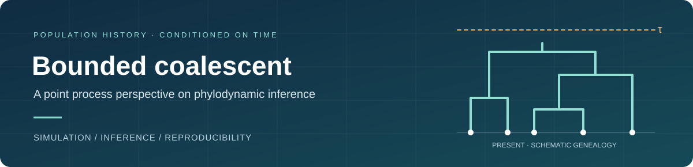

<p align="center">
  
</p>

# Bounded coalescent

**Simulation and phylodynamic inference for genealogies with a bounded time to their most recent common ancestor.**

Code and data accompanying *Phylodynamic inference with the bounded coalescent: a point process perspective*, by **Bingjing Tang, Shuangping Li, and Julia A. Palacios**.

[Find a table or figure](#from-the-paper-to-the-code) · [Redraw the results](#quick-start) · [Analysis contributions](analyses/README.md) · [Reproducibility notes](docs/reproducibility.md)

## Overview

The bounded coalescent conditions a genealogy on its most recent common ancestor occurring before a specified time bound. This repository brings together the simulation algorithms, maximum-likelihood examples, synthetic posterior-inference experiments, and Washington State COVID-19 analysis used in the paper.

The inference examples compare the bounded coalescent (**BC**) and standard coalescent (**SC**) likelihoods, using random-integral (**RI**) and discretized methods. The submitted synthetic comparison uses three population-size trajectories, 100 tips per genealogy, and 30 datasets per trajectory.

## From the paper to the code

Numbering follows the submitted manuscript. Some historical filenames refer to earlier drafts; use this index to locate the current results.

| Paper result | Location | What is available |
| :--- | :--- | :--- |
| **Figures 2–3** · Simulation validation and BC/SC comparison | [`simulation/`](simulation/) | Simulation functions and original plotting scripts |
| **Table 1** · Simulation timing benchmark | [`simulation/`](simulation/) | Partial benchmark code and saved simulation data |
| **Figure 4** · Maximum-likelihood examples | [`analyses/maximum_likelihood/`](analyses/maximum_likelihood/) | Original MLE scripts and a dedicated MLE entry point |
| **Figure 5 & Table 2** · Synthetic posterior inference | [`analyses/synthetic/`](analyses/synthetic/) | Synthetic datasets and original experiment scripts |
| **Figure 6** · Washington State COVID-19 | [`analyses/covid/`](analyses/covid/) | CCD0 genealogy and original analysis source |
| **Figures 5–6 redraws & Table 2 summary** | [`analyses/reproduction/`](analyses/reproduction/) | Saved curve coordinates, plotting tools, samplers, and recorded results |

The saved coordinates can be redrawn immediately. Full inference requires additional dependencies and substantial computation. The [reproducibility notes](docs/reproducibility.md) distinguish submitted results, later reruns, and historical scripts, including the remaining gaps in exact reproduction.

## Quick start

Clone the repository and redraw the saved synthetic and COVID-19 results with **base R**. This does not run MCMC or install packages.

```bash
git clone https://github.com/bingjingle/boundedcoal.git
cd boundedcoal
bash analyses/reproduction/run_all.sh redraw
```

For dependency checks, sampler settings, and optional reruns, see the [reproduction guide](analyses/reproduction/README.md). Original datasets and recorded result files are retained separately from newly generated output.

## Repository layout

```text
boundedcoal/
├── simulation/                 # Algorithms, validation, timing benchmark
├── analyses/
│   ├── maximum_likelihood/     # Figure 4
│   ├── synthetic/              # Figure 5 and Table 2 experiment sources
│   ├── covid/                  # Figure 6 genealogy and original source
│   └── reproduction/           # Shared samplers, saved curves, redraw tools
├── archive/cell_lineage/       # Earlier cell-lineage and UPGMA experiments
└── docs/                       # Reproducibility and file-move index
```

The repository remains at **[github.com/bingjingle/boundedcoal](https://github.com/bingjingle/boundedcoal)**, the address cited in the submission. Earlier work remains available in Git history; [the file-move index](docs/file-moves.json) connects the previous layout to this one.

## Contributions and citation

Analysis-specific contributions are documented in [`analyses/README.md`](analyses/README.md). Paper authorship is preserved in the citation below.

> Tang, B., Li, S., and Palacios, J. A. (2026). *Phylodynamic inference with the bounded coalescent: a point process perspective*. Manuscript.

The discretized inference implementation uses [`JuliaPalacios/phylodyn`](https://github.com/JuliaPalacios/phylodyn); see the reproduction guide for the required revision.
